<div align="center">

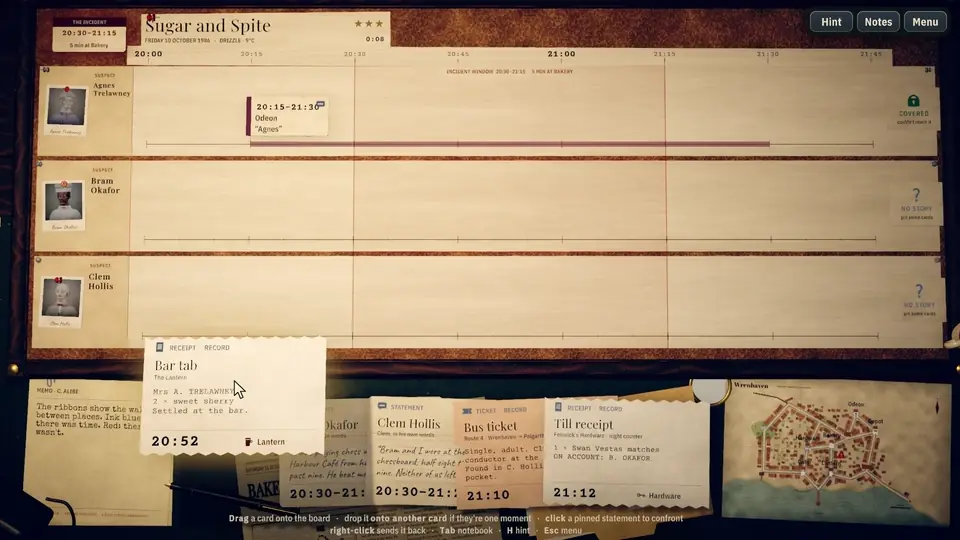

# Alibi & Co.

**Pin the evidence to the timeline. Then find the alibi that can't be true.**

A cozy-noir deduction game about physically assembling a timeline, and then breaking it.

[](https://unity.com/releases/editor/archive)
[](https://github.com/nearbycoder/AlibiAndCo/releases)
[](#tech-highlights)
[](#rebuilding-the-generated-assets)
[](#rebuilding-the-generated-assets)

[**Play in your browser**](https://nearbycoder.github.io/AlibiAndCo/) (all five cases; [notes](#play-in-your-browser)) ·
[**Download for Linux**](https://github.com/nearbycoder/AlibiAndCo/releases/latest) (v0.1.0: the first three cases; [why](#play-it)) ·
[Watch the trailer](docs/media/alibi-and-co-trailer.mp4) ·
[How to play](#how-to-play) ·
[Build from source](#build-from-source)

</div>

## Play in your browser

**[nearbycoder.github.io/AlibiAndCo](https://nearbycoder.github.io/AlibiAndCo/)**: today's game, all five
cases and the Daily Docket, with nothing to install, on a computer, phone or tablet. It needs a
browser with WebGL 2 (a current Chrome, Edge, Firefox or Safari) and downloads about 27 MB the first
time on a computer, about 30 MB on a phone or tablet (the browser keeps a copy for later visits).

- **On a phone or tablet:** play in landscape (in portrait the page asks you to turn the phone).
  Tap to choose, drag a card up to the board or just tap it, press and hold a card to read it, and
  pinch the board to zoom in (two fingers also pan). Beside the picture there's a column of
  thumb-sized buttons: **Menu** (or **Back** in the menus), **Notes**, **Hint**, **Fit** (the
  whole desk again, once you've zoomed) and **Full** screen where the browser has it (Android; not
  iPhone Safari, where adding the page to the home screen gives it the whole screen). They appear
  only on touchscreens and step aside as soon as a mouse, keyboard or gamepad is used. Phones and
  tablets start on the **Low** graphics step and phones on **Larger** text (Settings has the rest);
  the picture is drawn at up to twice the screen's points (about 2.6 million pixels at most), and
  the textures come as ASTC, which their GPUs read directly. If the browser closes the tab while
  you play (phones do when a tab runs short of memory), the next visit says so and starts on Low.
  The sound starts with your first tap; on an iPhone it follows the silent switch.
- **What's different from the desktop game:** progress and settings live in the browser's storage
  for this site (separate from a desktop install, and gone if you clear the site's data); a
  computer's first visit starts at the **Medium** graphics step rather than High; sound starts
  with your first click, key or tap, as browsers require; fullscreen (F11 or Settings) is up to the
  browser; there's no Quit button, resolution picker or F12 screenshot.
- **Tested in** headless browsers on Linux (the dev machine's Radeon 8060S), served from a
  `/AlibiAndCo/` folder with no special server headers, as GitHub Pages serves it
  (`Tools/check-pages.mjs`, `Tools/mobile-check.mjs`): Chromium 151 and Firefox 157 at 1920×1080
  load to the title with no console errors, a mouse-played session works, the graphics setting
  and the case in progress survive a reload, the sound waits for the first click, and the touch
  buttons never appear; WebKit with iPhone 15 and iPad Pro 11 profiles and Chromium with a Pixel 7
  profile play a session by touch (Case Files, case 1, a card dragged and one tapped onto the board,
  a hold to read, a pinch to 2.6× and Fit, Notes, Hint and Menu from the buttons), the first tap
  starts the sound, and portrait asks to be turned. At the title the game's WebGL memory went from 235
  to 89 MB on the iPhone profile, 336 to 129 MB on the iPad and 281 to 86 MB on the Pixel; its wasm
  heap stays about 206 MB (247 MB after a played session). Not yet tried on a real phone or
  tablet, in Safari itself, or by a person's fingers: the notch and home-indicator margins, the
  silent switch and how much memory iOS really allows a tab can only be seen on a device.

## Trailer

[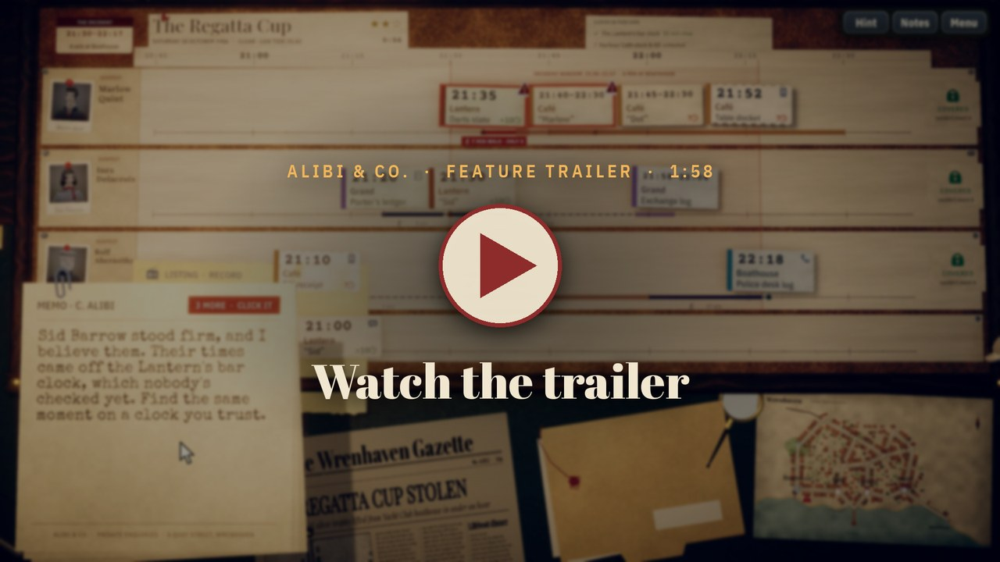](docs/media/alibi-and-co-trailer.mp4)

*Click the poster to open the trailer (1:58, 1080p, sound on). Every shot is the game playing
itself at the **Ultra** graphics step, recorded frame by frame, with its own music and sound and no
narration. The copy attached to the
[v0.1.0 release](https://github.com/nearbycoder/AlibiAndCo/releases/tag/v0.1.0) is the earlier cut from
4 October, made before cases 4 and 5, the Daily Docket and the other changes since.*

## About

Wrenhaven, a harbour town in autumn 1986. You're the "& Co." at retired Detective Inspector
Connie Alibi's two-desk agency. Five small crimes, five nights, one cork board.

Every receipt, phone log, ticket stub, press photo and witness statement says that **someone was
somewhere at a certain time**. Pin them onto each suspect's line and the board measures the walk
between them on a real town map. Blue ribbons mean there was time. A red ribbon means a story
has just become physically impossible, and somebody, or some clock, is wrong.

Confront the liars. Link two records of the same moment to catch a clock running slow. Watch
every card that clock stamped slide to its true time, and an alibi that looked perfect a minute
ago splits open with a minute to spare. Then drag the incident card into the only line it fits.

**The board does the arithmetic. You do the doubting.**

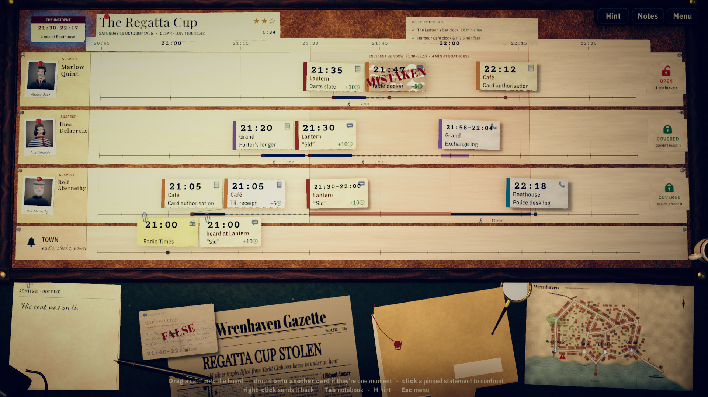

## How to play

| Input | Action |
|---|---|
| **Drag** a card from the tray onto the board (or click it) | Pin it to its person's line at its printed time |
| **Hover** a card | Lift it, read it in full, and see the walk to and from it on the town map |
| **Hover** the town map | Zoom in on Wrenhaven |
| **Hover** the memo on the desk | Hold it up to read it larger; the next memo waits until you let go (click it for the next) |
| **Hold a card on another card** until it says **LINK**, then drop it | **Link**: "these are the same moment, seen on two clocks" |
| **Click** a pinned card | Open its panel: **Confront** the witness, **Same moment as…**, or send it back |
| **Same moment as…**, then **click** the other card | **Link** in two clicks, no drag needed (right-click or **Esc** cancels) |
| **Right-click** a pinned card | Send it back to the tray |
| **Drag the incident card** | Preview where the crime fits; drop it on a line to accuse |
| **Tab** (or *Notes*) | The notebook: where the case stands, what each clock does, every memo and reply (scroll for older notes) |
| **H** or **F1** | Ask Connie for a hint (the case is marked "with Connie's help"); the cards it names wear a **CONNIE** tag |
| **Space** or click | Finish typing a memo, or show the next one waiting; skip the reconstruction |
| **Esc** | Pause: resume, restart, case files, settings, quit |
| **F11** / **F12** | Toggle fullscreen / save a screenshot |

It's played with a mouse and keyboard, a gamepad, the keyboard alone, or (in the browser) a
touchscreen:

| Gamepad | Action |
|---|---|
| **Left stick** (D-pad for fine steps) | Move the cursor |
| **LB / RB** | Jump to the previous / next card (or button, in menus) |
| **A** | Click: pin a card, open a pinned card's panel, press a button. **Hold A and steer** to drag. To link without a drag: **A** on a pinned card, **Same moment as…**, then **A** on the other (**B** cancels) |
| **B** | Send a pinned card back to the tray; back or close in menus |
| **X** / **Y** | Ask Connie for a hint / the notebook (the **right stick** or **D-pad** scrolls its notes) |
| **Start** | Pause and resume |

The prompts name the pad in your hands: Xbox letters by default, **✕ ○ □ △, L1 R1, Options** on a
PlayStation pad, and on a Switch Pro controller the Nintendo letters for the same places (the
bottom button, which pins, reads **B**).

Or with the keyboard alone:

| Keyboard | Action |
|---|---|
| **Arrow keys** | Move the cursor (slow at first, faster the longer they're held) |
| **Q / E** | Jump to the previous / next card (or button, in menus) |
| **Enter** | Click: pin a card, open a pinned card's panel, press a button. **Hold Enter and steer** with the arrows to drag. To link without a drag: **Enter** on a pinned card, **Same moment as…**, then **Enter** on the other (**Backspace** cancels) |
| **Backspace** | Send a pinned card back to the tray; back or close in menus |
| **Tab**, **H**, **Space**, **Esc** | The notebook, a hint, the next memo, pause (as above) |
| **Up / Down**, **Page Up / Page Down** | Scroll the notebook's notes while it's open |

Or with a touchscreen, in the browser build:

| Touch | Action |
|---|---|
| **Tap** a card | Pin it; on a pinned card, open its panel (**Confront**, **Same moment as…**, **Back to the tray**) |
| **Same moment as…**, then **tap** the other card | **Link** without a drag (tap an empty spot to cancel) |
| **Drag** a card | Pin it, link it (hold it on the other card until it says **LINK**), or drag the incident card to accuse |
| **Press and hold** a card | Read it in full (lift your finger and nothing is clicked) |
| **Press and hold** the memo | Hold it up to read it larger |
| **Hint**, **Notes**, **Menu** | The buttons at the top right (drag the notebook's notes to scroll them) |
| **Tap** the memo (or an empty spot) | Show the next memo waiting |

Touching the mouse hands control straight back. The board is laid out for a landscape screen the
size of a tablet or larger; phones aren't a target.

### The rules

- **Paper beats people.** Records (receipts, logs, tickets, photos) are never false, but their
  clocks can be wrong. Statements can be false, and a lie isn't proof of guilt.
- **Confront** a statement that's in a contradiction. If it's false, the witness admits it and
  the card is stamped FALSE (or MISTAKEN). If it's true, they stand firm and you lose a badge.
- **Link** two cards that describe the same moment. If one clock is trusted, the other clock's
  error is found, and every card stamped by it slides to its true time. A wrong link costs a badge.
  A link only arms once the dragged card has rested on the other one for about half a second and
  the **LINK** tag shows, so a card that merely lands on another on its way to a lane (or back to
  the tray) is pinned or returned as usual, not linked. Without a drag: click a pinned card, choose
  **Same moment as…**, then click the other card.
- **Unknown-person cards** (a cash receipt, a figure in a photo) show candidate faces. Each face
  is crossed out when that person's paper trail rules them out. When one is left, the card flies
  to their line.
- Each suspect shows a lock: **COVERED** if they couldn't have reached the scene for long enough
  inside the incident window, **OPEN** if they could. The incident can only be pinned when the
  tray is empty, nothing is contradicting, and it fits exactly one line, so a wrong accusation is
  impossible by construction.
- Each case is rated with three badges (one lost per wrong confrontation or link) and a timer,
  which only runs while the game has focus (alt-tab away and it waits), and awards up to three seals: **Clean** (no badge lost), **Unaided** (no hint) and **Swift**
  (under the case's par time). Each case file lists the three with its par time and ticks the ones
  already earned, and the case files keep the best of each, so a solved case still has something to
  replay for.

## Features

**A timeline you build with your hands.** Cards lift, tilt with the drag and snap onto the cork
with a pin. Each one lands on its person's line at its printed time, and the gaps between them
fill with walking-time ribbons measured on the town map.

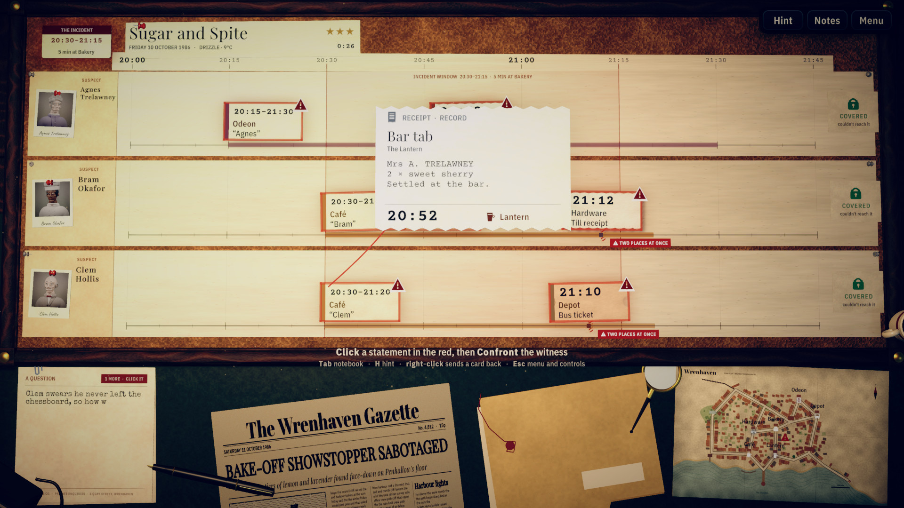

**Clocks that lie.** A pub clock, a café till, a press camera's date-back: every card names the
clock that timed it, and some of those clocks are wrong. Link a record to one you can trust (the
telephone exchange, the BBC, the church bells, the Electricity Board) and every card on the bad
clock glides to its true time. That's how one receipt moving five minutes can sink an alibi.

**Readable without red.** Every card in a contradiction also wears a dark warning triangle on its
corner, and the locks say COVERED or OPEN with different icons, so the board can be read by
colour-blind players too (checked with protanopia, deuteranopia and tritanopia simulations).

**Confront, and be wrong.** Liars crack, the mistaken correct themselves, and the truthful stand
firm and cost you a badge. Being lied to isn't the same as finding the culprit.

**Identity by elimination.** Who's the figure in the oilskin? Unknown-person cards cross out
candidate faces live as the records rule people out.

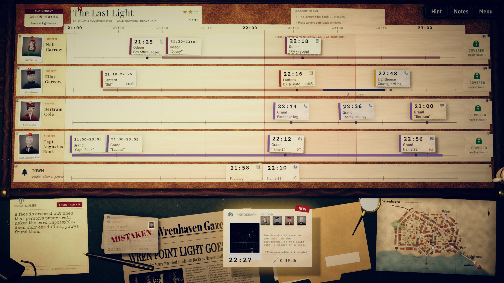

**Connie, the notebook and hints.** Short typed memos from your mentor teach each idea the first
time it comes up. The notebook (Tab) keeps every question, witness reply, clock and alibi status.
When a move brings several memos at once, each one stays on the desk long enough to read (about 185
words a minute), its slip says how many more are waiting and how to see the next one now, and a
question the board has already answered by the time its turn comes is passed over (the notebook
still has it). Hover the memo (or rest a finger on it) and it's held up off the desk at nearly twice
the size, and nothing replaces it until you let it go.
Hints point at the next step, never the answer, and the cards a hint names wear a brass **CONNIE**
tag until the board changes (with a pad or the keyboard, the next jump lands on them). When an honest witness stands firm and costs you a
badge, Connie tells you what made their story red (usually a clock nobody has checked yet, by name),
and after a wrong link she says why it couldn't have worked: both clocks were already right, one
clock was on both cards, neither clock had been checked, or (naming the unchecked clock) the two
cards didn't see the same moment.

**The accusation and the reconstruction.** Drag the incident across the board: it refuses the
covered lines and drops into the one with a hole in it. A brass pawn then walks the culprit's
route across the map while the night replays, the CASE CLOSED stamp lands, and the *Wrenhaven
Gazette* prints the front page.

**Restrained detective audio.** Brushed-drum noir jazz, rain on the window, a ticking desk clock,
typewriter keys for memos, a paper-and-pin foley set, and a glass-and-piano hit when a lock
breaks. All of it is synthesized from code.

**A new docket every day.** Once the second case is closed (its closing panel says so), the case
files offer the *Daily Docket*, and after the last case the panel has a *Today's docket* button: a short generated case for the day, with three of the town's regulars, a small crime and
three stories. It's built from the town map and its people, and the same validator that checks the
handwritten cases proves each one airtight before it's offered. On some days a wrong clock puts an
honest story in the red. The last seven days stay in the docket drawer, so a missed day can still be
played for a week, and the case files keep each day's best result. **Copy result** puts a
spoiler-free line on the clipboard to send a friend (the day, the crime, the stars, the time and the
seals). The drawer and the closed panel count your run of days in a row (a day made up from the
drawer counts).

**Settings that matter.** Master, music and effects volume (each shows its level); resolution; **graphics
fidelity** (Low, Medium, High or Ultra, below); text size (Normal,
Large, Larger) for menus, the HUD, the notebook, the hover card, the chips pinned on the board,
the board's labels and the memo slips (windows under 900 pixels tall start at Large); **plain
lettering**, which sets the memos, statements, records, notebook, case files and epilogues in a
plain sans (DejaVu Sans) instead of the typewriter, handwriting and Courier, for anyone who finds
those hard to read, while titles, times and buttons keep their faces; fullscreen;
reduced motion; and an optional case timer. They're laid out in two headed columns (Sound and Picture;
Reading, Play and Progress, which has *Erase all progress* and asks first), and each change applies at
once. Menus rise and grow into place in about a third of a second; with reduced motion they simply
appear. Progress and settings save automatically, and every
case and docket keeps its own board: leave case 4 half-solved, play today's docket, and case 4 is
still there, pins, badges and timer, when you open its file again (*Continue* on the title picks up
the board you played last).

**Controls when you need them.** A single line on the board's frame shows the gesture that matters
right now (pin, confront, link, accuse), and each tip retires once you've used it. The pause menu
has the full controls list, as a two-column table for whichever you're using: the mouse, the keys, a pad
(with its own button names) or a finger. A link doesn't need a drag at all: click a pinned card and choose
**Same moment as…**, then click the card that saw the same moment (handy with a pad, the keys or a finger).
A link only happens when you mean it: a dragged card has to
rest on the other card until a **LINK** tag appears, so a card that just lands on another on its
way to a lane never costs a badge. The case timer waits while the game is in the background,
where the game also drops to 10 frames a second.

**Graphics fidelity, Low to Ultra.** One slider with four notches, applied the moment it moves. **High** is the
look the game was built with and stays the default: 4× MSAA with SMAA, soft lamp and window shadows, ambient
occlusion, bloom, film grain and colour grading. **Medium** (2× MSAA, softer and cheaper shadows,
half-resolution occlusion, quarter-resolution bloom) and **Low** (FXAA, hard lamp shadows, no window shadows,
occlusion, bloom or grain, half the dust) are for weaker graphics. **Ultra** draws the picture at 1.5 times the
window's size and scales it down (never above 4K's pixel count), with high-sample occlusion, high-quality bloom,
a sharper shadow map for the window's light, 64-bit HDR colour, 16× anisotropic filtering and twice the dust and particle bursts. No step
draws the board's text below the window's resolution, so chip times stay sharp on Low.

## Content

Five handcrafted cases on one shared town map. The first three each introduce one idea, and the
last two combine them in new ways. Every case is proven airtight by the solver (exactly one consistent
answer, and no way to accuse the wrong person).

| Case | Night | Suspects | What it teaches |
|---|---|---|---|
| **1. Sugar and Spite** | Friday 10 October 1986 | 3 | Pinning, ribbons, contradictions, confronting, two-person statements, the incident pin. About 5 minutes. |
| **2. The Regatta Cup** | Saturday 18 October 1986 | 3 + Town | Clocks and links: a calibration can clear one person and sink another. About 10 minutes. |
| **3. The Last Light** | Saturday 1 November 1986 | 4 + Town | Unknown-person cards, camera date-back clocks and mistaken identity. About 15 minutes. |
| **4. Remember, Remember** | Wednesday 5 November 1986 | 4 + Town | Returning faces. The crime itself was timed by a wrong clock, an honest witness turns red until it's fixed, and a nameless entry in a door book has to be traced. About 15–20 minutes. |
| **5. The Wrenhaven Lily** | Saturday 13 December 1986 | 3 + Town | A chain of clocks. One clock can't be checked against anything reliable, only against another wrong clock once that one is mended, and that clock timed the crime. About 15–20 minutes. |

Cases unlock in order, and the case files keep your best rating, time and seals for each.

**The Daily Docket** is a sixth, endless file: a three-suspect case generated for each calendar day
(about 3 minutes, case 1's size), on a rota of fifteen small crimes around Wrenhaven. About a third
of days add a wrong clock and an honest witness in the red. It opens when case 2 is closed, and the
last seven days' dockets stay in the drawer.

## Screenshots

All at the Ultra graphics step, 1920×1080, from the trailer capture.

| | |
|---|---|
| 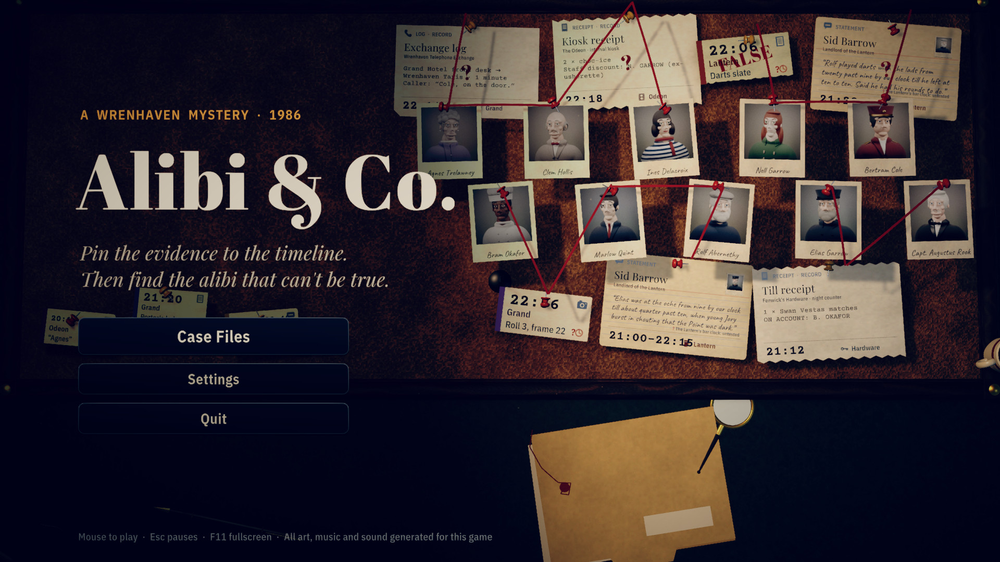 | 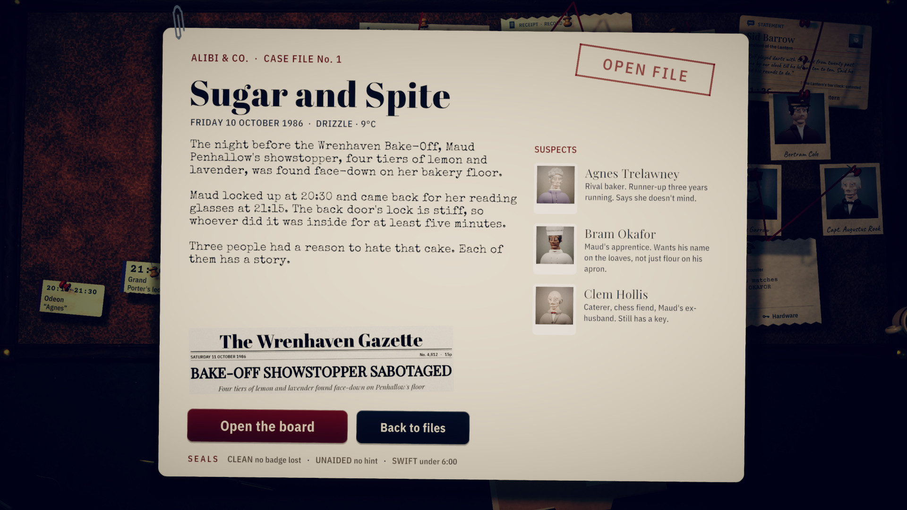 |
| 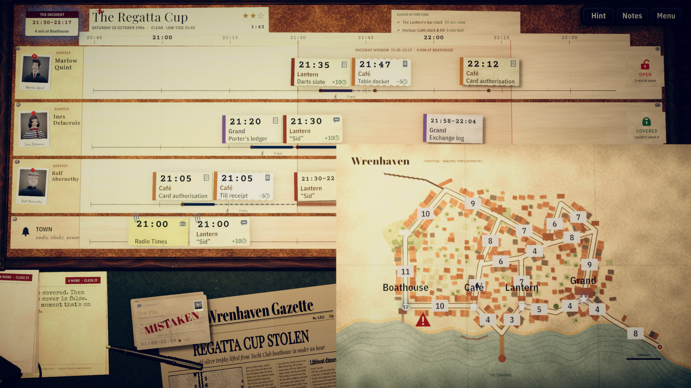 | 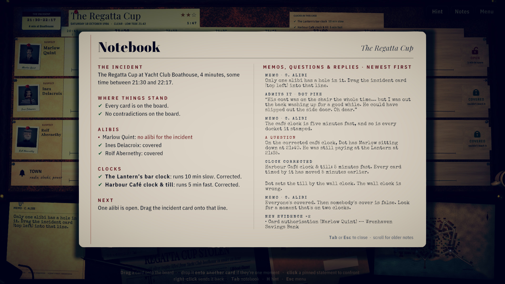 |
| 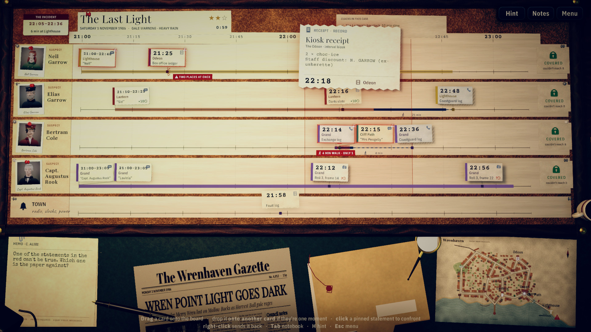 | 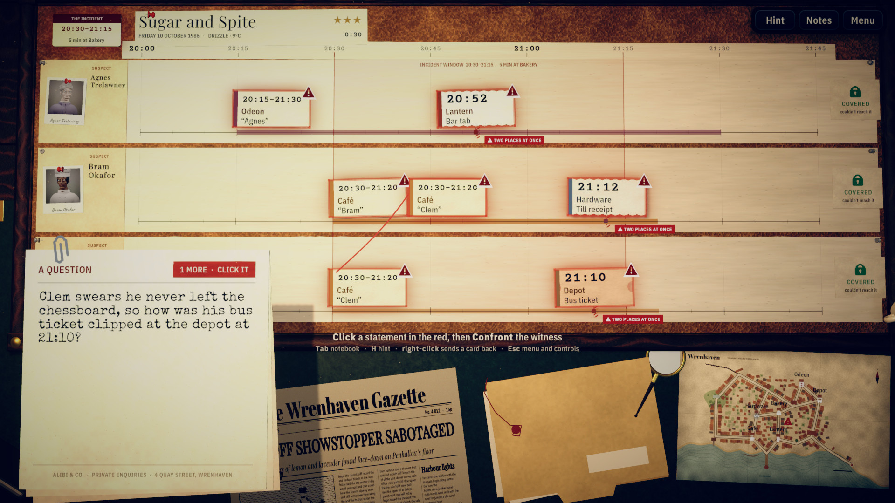 |
| 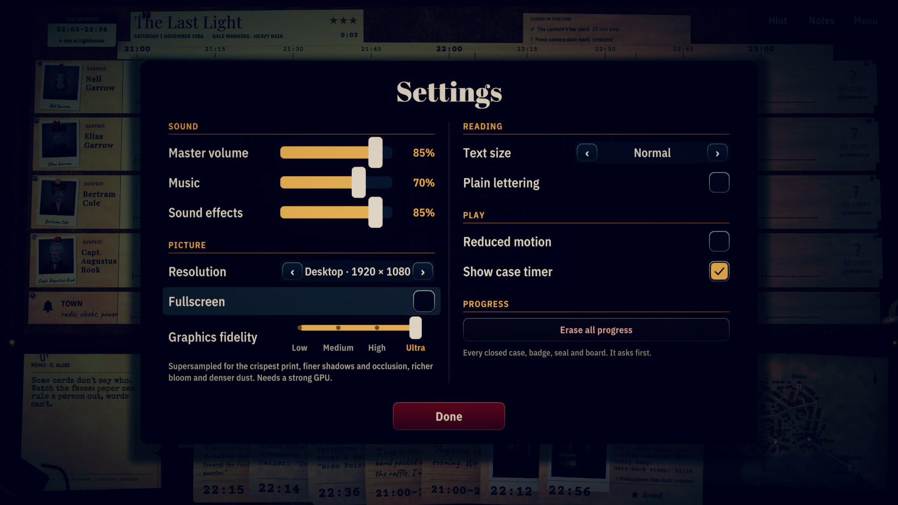 | 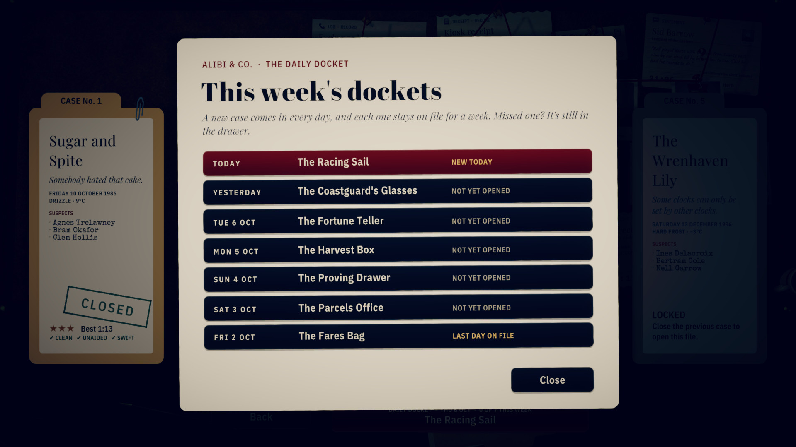 |
| 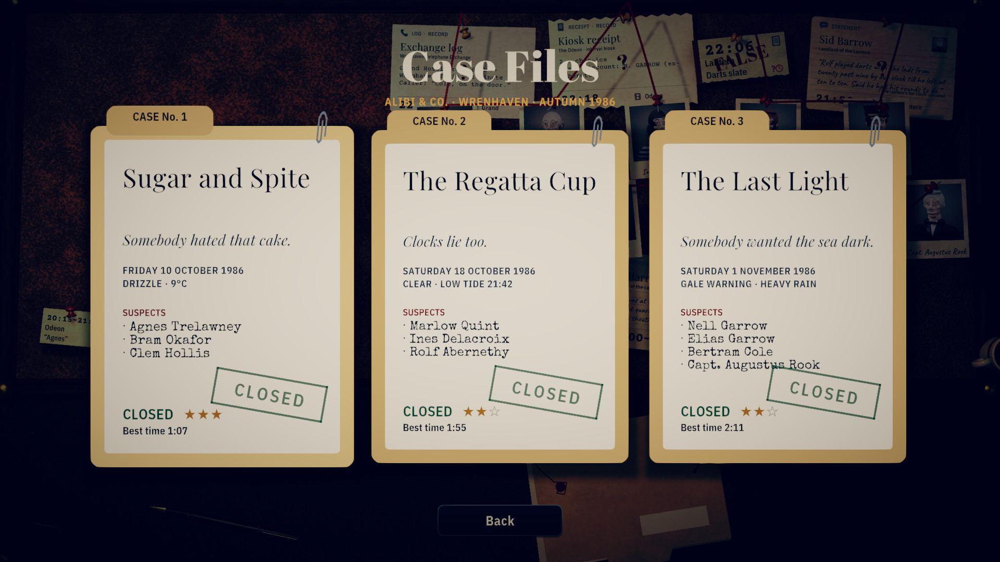 | |

## Play it

> **The published release is older than this README.** `v0.1.0` (4 October 2026) has the first three
> cases and none of the changes since: cases 4 and 5, the Daily Docket, gamepad, keyboard-only and touch
> play, the seals, plain lettering, the graphics fidelity steps and the rest. To play the game this page
> describes, [build it from source](#build-from-source).

1. Download `AlibiAndCo-v0.1.0-linux-x86_64.zip` from the
   [latest release](https://github.com/nearbycoder/AlibiAndCo/releases/latest).
2. Unzip it anywhere and run `./AlibiAndCo.x86_64`.

On a Wayland desktop, if the window doesn't appear, start it with `./AlibiAndCo.x86_64 -force-wayland`
(Unity's native Wayland backend). Progress and settings are stored in `~/.config/unity3d/AlibiAndCo/`.

### System requirements

- **OS:** 64-bit Linux (x86_64). Built and tested on CachyOS with KDE Plasma (Wayland); other distributions
  haven't been tried.
- **Graphics:** a GPU with OpenGL 4.5. On the development machine the player runs on OpenGL Core
  (Mesa, AMD Radeon 8060S, an integrated GPU); Vulkan and other GPUs haven't been tried. On that GPU a
  busy board at 1920×1080 takes 1.7 ms a frame on Low and 8.1 ms on Ultra (see
  [Graphics fidelity](#features)).
- **Screen:** landscape, 1280×720 or larger (1920×1080 is the reference; autoplay also checks 1024×768 and
  3440×1440, see [Status and known issues](#status-and-known-issues)).
- **Disk:** about 135 MB unpacked (a build of today's game).
- **Input:** a mouse, a keyboard alone, or a gamepad (touch in the browser build).

Archives made with `Tools/package.sh` (see below) also include `AlibiAndCo.sh`, which adds
`-force-wayland` by itself on a Wayland desktop. The v0.1.0 zip predates it.

There's also a [browser version](#play-in-your-browser). To make it yourself, `Tools/build-pages.sh`
builds it into `Builds/Pages/` (about 27 MB) as a static site that plays from any folder; serve that
over HTTP (for example `python3 -m http.server` inside it) and open `index.html`.

There are no published Windows or macOS builds yet. A macOS build can be made from source on Linux
(`Tools/unity.sh build-mac`), but it hasn't been run on a Mac. Windows needs Unity's Windows Build
Support module.

## Build from source

**Requirements:** Unity **6000.6.2f1** (Unity 6.6) with the Universal Render Pipeline, which is
set up by the project. To regenerate assets you also need Blender **4.5** and Python 3 with
`Tools/requirements.txt` (NumPy, Pillow, SciPy), plus FFmpeg for recordings and the trailer.

```sh
git clone https://github.com/nearbycoder/AlibiAndCo.git && cd AlibiAndCo
Tools/unity.sh build-linux      # batch build to Builds/Linux/AlibiAndCo.x86_64 (validates the cases first)
Tools/play.sh                   # run the build at 1920x1080 (native Wayland when available)
Tools/unity.sh                  # or open the project in the Editor

Tools/unity.sh build-mac        # Builds/macOS/AlibiAndCo.app: Universal (Intel + Apple Silicon), Mono
Tools/unity.sh build-windows    # Builds/Windows/AlibiAndCo.exe (needs Windows Build Support installed)
Tools/unity.sh build-webgl      # Builds/WebGL: browser build (Assets/WebGLTemplates/Alibi page)
Tools/build-pages.sh            # the same, laid out for GitHub Pages in Builds/Pages/ (with .nojekyll)
Tools/package.sh [--no-build] [version] [linux] [mac] [windows] [webgl]
                                # build, then zip into Builds/Release/ with SHA256SUMS (nothing is uploaded)
```

The scripts expect the Editor at `~/Unity/Hub/Editor/6000.6.2f1/Editor/Unity`. Set `UNITY=/path/to/Unity`
to use another location. On distributions that only ship `libxml2.so.16`, the Editor needs
`libxml2.so.2`: install your distro's legacy libxml2 package (for example `libxml2-legacy`), or
put a copy in `~/.local/share/ptt-unity-libs/`, which `Tools/unity.sh` adds to the loader path.

### Tests and validators

| Command | What it does |
|---|---|
| `Tools/validate.sh [--verbose]` | Compiles the game's own `Assets/Scripts/Logic/` into a console app and proves every case airtight. It uses a system `dotnet` or the .NET 8 SDK inside the Unity Editor. `--verbose` walks through each solution. |
| `Tools/validate.sh --docket N [yyyy-MM-dd]` / `--docket-show yyyy-MM-dd` | Generates and proves N consecutive Daily Dockets (and reports how many variations the worst day needed), or prints one day's docket in full with its solution. |
| `Tools/validate.sh --docket-phrases N [yyyy-MM-dd]` | Lists the sentences that turn up on more than a quarter of N consecutive dockets: the template showing through. |
| `Tools/unity.sh validate` / `Tools/unity.sh test` | The same validator inside Unity, and the EditMode tests in `Assets/Tests/EditMode`. |
| `Tools/autoplay.sh [outdir]` | Launches the built game, plays every case and six Daily Dockets (today's, yesterday's, three fixed days, and one from earlier in the week opened through the docket drawer) through the real session code with the solver's moves. It confronts an honest witness on purpose in case 4 and on a clock day, to check they stand firm and that Connie names the clock to blame, and makes a wrong link in case 3 to check Connie says why. It checks every contradiction carries its marker, that no text on the board runs into other text or an icon (`[Collide]`: chip times, a card's clock line, the clock legend against the ruler, the title card and the HUD buttons), the docket run on the closed panels and the drawer, that a replayed case 2 doesn't announce the docket again, and which reading texts are in which lettering; it saves a screenshot per step (to `Captures/autoplay` by default) and prints PASS/FAIL. Add `-alibiPlainText` (through `Tools/play.sh -alibiCapture <dir> -alibiPlainText`) to play it all in plain lettering, which fails if any reading text is left in a decorative face. |
| `Tools/play.sh -alibiInputTest [outdir]` | Drives case 1 with simulated mouse input (drag, hover, right-click, a click on *Plain lettering* in Settings mid-case and the graphics fidelity slider set by clicks and a drag, Confront, the incident drag) and checks every gesture lands, then goes on to case 2 to check that a card dropped in one movement onto another card pins or goes back to the tray without linking, and that one held there until the LINK tag shows does link; then links a pair through the card panel's *Same moment as…* (cancelling once with a right-click first). |
| `Tools/play.sh -alibiPadTest [outdir] [-alibiPadLayout ps\|nintendo]` | Plays case 1 to the end with a simulated gamepad only (stick, LB/RB jumps, A to pin and drag, B, X, Y, Start, the right stick and D-pad to scroll the notebook, and the graphics fidelity slider in Settings), then steers through the case files and the docket drawer to an earlier day's board, and links a pair in case 2 through *Same moment as…* (B cancels once first), and prints PASS/FAIL. It checks the controls strip, the pause menu and the notebook footer name that pad's buttons: a PlayStation pad (by its Input System layout) or a Switch Pro controller (by its name, as a browser reports it). The mouse input test also goes on to the drawer. |
| `Tools/play.sh -alibiFidelityBench [outdir] [-alibiBenchSeconds n]` | Holds the title's polaroid wall and a busy board (case 3, every named card pinned) still, then sets each graphics fidelity step in turn (Low, Medium, High, Ultra, then High again) and, at each, saves a screenshot of that same frozen moment and measures frame times with vsync off (mean, median, 95th percentile, with the machine's load average). Writes `fidelity-bench.md`. `-alibiFidelity n` starts any run at a step (0 Low to 3 Ultra). |
| `Tools/play.sh -alibiScreensTour [outdir]` | A quick look at the menus at the window's size and text size (add `-alibiTextSize n`): Settings over the title and over the pause menu with a layout check (rows apart, inside the panel, no label overflowing or wrapping), the pause menu's controls list measured for the mouse, keys, pad and touch (one line per row, inside its card), and the pause panel's settle logged frame by frame, with and without Reduced motion. About 25 seconds. |
| `Tools/play.sh -alibiMemoTest [outdir]` | Opens case 1, posts three memos at once and checks, in game time, that each stays its reading time, that the slip's MORE tag counts them down, that Space finishes typing and then shows the next, and that a question answered before its turn is passed over. Then it hovers the slip with the mouse and checks it's held up at least 1.6 times as large, inside the window, that nothing replaces it while it's held, that a click on it shows the next, and that a finger held on it reads it without moving on while a tap moves on. It logs the slip's size and body text before and after. The pad, keys and touch tests also check the tag names their control. |
| `Tools/play.sh -alibiHintTour [outdir]` | Asks Connie twice before every move of case 4 and a clock day's docket, and checks the CONNIE tags sit on exactly the cards each hint names, clear once the move is made, and that the first Q/E jump after a hint lands on one. |
| `Tools/play.sh -alibiKeysTest [outdir]` | The same with simulated key presses only (arrows, Q/E, Enter, Backspace, Tab, H, Esc, and Down and Page Up in the notebook), including the graphics fidelity slider and the link through *Same moment as…* (Backspace cancels). |
| `Tools/play.sh -alibiTouchTest [outdir]` | Plays case 1 to the end with a simulated touchscreen only: taps, finger drags, a press held to read a chip, the card panel, the Hint, Notes and Menu buttons (each must act once per tap), the graphics fidelity slider in Settings, the notebook's notes dragged to the oldest and back, and the incident drag; then a link in case 2 by taps through *Same moment as…* (a tap on nothing cancels). |
| `Tools/play.sh -alibiFocusTest [outdir] [-alibiFocusReal]` | Opens case 1 and checks the case timer stands still while the game is out of focus and runs again when it's back, and that the game drops to about 10 frames a second while away (it logs frames a second and the CPU time of the game's threads, attended and away, at the title and on a board): through Unity's focus handler, or with `-alibiFocusReal`, by waiting for a real focus change from outside. |
| `Tools/play.sh -alibiBoardsTest [outdir]` | Leaves three boards part-way (case 1, case 2 with a badge lost, today's docket) and checks every one is kept: the folders and the drawer say IN PROGRESS, *Continue* resumes the last, each case reopens with its own pins, badges and timer, *Start over* asks first, and solving one drops only its own board. |
| `Tools/play.sh [-alibiClockAt yyyy-MM-ddTHH:mm:ss] -alibiMidnightTest [outdir]` | Leaves today's docket in progress, opens the docket drawer and waits for midnight (within 20 minutes; `-alibiClockAt` starts the game's clock at a chosen moment), then checks the drawer redrew itself for the new day and that Continue resumes yesterday's docket. |
| `Tools/play.sh -alibiClipboardCheck -alibiShareCheck [outdir]` | Solves today's docket, clicks Copy result and holds the line on the system clipboard for 8 seconds, so a script can read it from outside. Without `-alibiClipboardCheck`, automated runs never touch the system clipboard. |
| `XDG_CONFIG_HOME=<scratch> Tools/play.sh -alibiSaveCheck [outdir]` | Loads the save the way a normal launch does (falling back to the backup if the main file is unreadable), logs what came back, captures the title and case files, saves once and quits. It refuses to run against the real save folder. |
| `node Tools/check-pages.mjs <url> [--engine chromium,firefox] [--play]` | Checks the browser build where it's served (the GitHub Pages site, or `Builds/Pages/` served locally under `/AlibiAndCo/`): exits 0 only if the plain page reaches the title with no console errors or failed requests. `--play` adds a real-mouse session at 1920×1080 in a fresh profile: the sound must wait for the first click, Settings > Low (and fullscreen on and off), case 1's board with two cards pinned, then a reload that must come back on Low with the case in the save. Logs and screenshots go to `Logs/pages/check/`. Needs `playwright-core` (Chromium) and/or `puppeteer-core` (Firefox), as below. |
| `node Tools/webtest.mjs [--engine chromium,firefox,webkit] [--only autoplay,pad,keys,share,reload,focus,touch,touchreal]` | Serves `Builds/WebGL/` locally and, in headless browsers, runs autoplay (`?autoplay`, then reads back the copied docket result), the pad and keyboard tests (`?padtest`, `?keystest`), Copy result with a real click (`?sharecheck`), a reload check that the save persists (`?savecheck`), the focus check with the page sent to the background (`?focustest`), and the touch tests: simulated inside the game (`?touchtest`) and with real touches sent through the browser (`?touchreal`: a tap, a drag, a held finger on a card and on the memo, a HUD button, and a link by three taps). It logs load time, frame rate and console errors. It needs `playwright-core` and/or `puppeteer-core` from elsewhere (see the script's header); they aren't dependencies of this repo. |
| `Tools/nested.sh [--size WxH] [play.sh args]` | Runs the game, or any self-test above, inside a private nested KWin (`kwin_wayland --virtual`, with its own Wayland socket, D-Bus session and config folder, closed afterwards, along with anything the session woke up, such as `ksecretd` or a desktop portal: whatever still carries the session's bus address, config folder or socket is stopped). The window is certainly on screen there, so it runs at its real frame rate: on the development machine the self-tests ran at 52–56 fps inside it against about 11 on the shared desktop, where the compositor throttles a covered window. It can't go fullscreen on the real desktop, the real pointer can't reach it, and the player's prefs land in a scratch folder. It needs KDE's KWin. |
| `Tools/record.sh [out.mp4] [cases]` | Records the game playing itself at a locked 30 fps and rebuilds the soundtrack offline from a per-frame voice log. |

Automated runs use a blank in-memory save, so they never touch your progress.

Saves are crash-safe: each one is written to a temporary file and renamed into place, and the
previous save is kept as `alibi_save.json.bak`. If the save can't be read (say, after a crash or a
full disk), the game loads the backup and moves the broken file aside as
`alibi_save.unreadable-<date>.json` rather than overwriting it. The save keeps one board per case
and docket that's been left part-way (a docket's goes once its day leaves the drawer); saves from
before that, which held a single board, load as they were.

### Rebuilding the generated assets

Every model, portrait, press photo and the town map is generated by scripts in `ArtSource/` and
exported into `Assets/Resources/`. The `.blend` files next to them are the generators' saved
scenes (zstd-compressed). The suspects are built from fused ellipsoids, voxel-remeshed and
smoothed into one surface. The town map is built from `Assets/Resources/Data/town.json`, so its
streets match the game's walking times exactly.

```sh
blender -b -P ArtSource/build_assets.py -- props [--only lamp,mug] [--preview]
blender -b -P ArtSource/build_assets.py -- cards [--preview]       # card silhouettes per evidence kind
blender -b -P ArtSource/build_assets.py -- portraits [--preview]
blender -b -P ArtSource/build_assets.py -- map
blender -b -P ArtSource/build_assets.py -- photos
blender -b -P ArtSource/build_assets.py -- all

python3 -m venv .venv && .venv/bin/pip install -r Tools/requirements.txt
.venv/bin/python Tools/photo_finish.py portraits   # 1980s print look for portraits ...
.venv/bin/python Tools/photo_finish.py photos      # ... and press photos
.venv/bin/python Tools/map_finish.py               # paper finish for the town map
.venv/bin/python Tools/make_textures.py            # every texture and icon, procedurally
.venv/bin/python Tools/newspaper.py                # each case's Gazette front page
.venv/bin/python Tools/make_icon.py                # the app icon
.venv/bin/python Tools/synth_audio.py              # all music, ambience and SFX (deterministic)
.venv/bin/python Tools/audio_qa.py                 # loudness, peaks, DC offset, clipping, loop seams
```

### Rebuilding the trailer and README media

```sh
Tools/capture_trailer.sh                       # the game plays itself in trailer mode -> Captures/trailer/
.venv/bin/python Tools/make_trailer.py         # -> docs/media/alibi-and-co-trailer.mp4, trailer-poster.jpg,
                                               #    teaser.webp and the README's screenshot-*.jpg
```

The capture runs the built game inside a private nested KWin (`Tools/nested.sh`) at the Ultra graphics step
(`FIDELITY=0`–`3` picks another) with the game's clock stepped one frame at a time, so it's smooth however
busy the machine is. It plays the first three cases (the trailer's cut) and the Daily Docket for a fixed day
(`DOCKET=yyyy-MM-dd`, 8 October 2026 by default) with scripted mouse and keyboard input, stages the beats
the solver never plays (a hovered route, a memo held up, a witness standing firm, a link made through
*Same moment as…*, a wrong link, a hint, the notebook, the pause menu and the settings), logs a
frame-numbered marker per beat and saves cursor-free stills. `make_trailer.py` cuts the trailer from
those markers, so every shot is a named beat rather than a timestamp; its work files go in
`Captures/trailer-work.*` (deleted afterwards unless `KEEP_WORK=1`).

## Project structure

```
Assets/Scripts/Logic/   pure C# board logic (no UnityEngine), shared by the game and the validator
Assets/Scripts/Game/    the Unity side: stage, board, cards, drag, map, memos, reconstruction,
                        autoplay, showcase/recorder
Assets/Scripts/UI/      runtime-built uGUI screens: title, case files, intro, notebook, pause, settings, closed
Assets/Scripts/Audio/   music crossfades, ducking, the SFX bank
Assets/Resources/       Data (case and town JSON), Models, Portraits, Photos, Audio, Textures, Icons, Fonts
Assets/Editor/          build script and project setup (materials, fonts, URP, scene)
Assets/Tests/EditMode/  validator and solution-replay tests
ArtSource/              Blender generator scripts and their saved .blend scenes
Tools/                  build, play, autoplay, record, validate, asset, audio and trailer scripts
docs/PLAN.md            the full design and technical plan (spoilers: it walks through every solution)
docs/media/             README and trailer media
```

## Tech highlights

- **One logic core, two hosts.** Everything that decides the game (`Board`, `CaseData`,
  `TownMap`, the solver) is plain C# in `Assets/Scripts/Logic/`. Unity renders it, and a .NET
  console app compiles the same files to check it, so the game and the validator can't disagree.
- **Generated cases, proven at runtime.** The Daily Docket writes ordinary case JSON from a
  date-seeded generator of its own (SplitMix64, so a date gives the same case in Unity, the browser
  and .NET), and the game runs the full validator on it before offering it, trying the next
  variation if it fails. Ten years of dates (3,653 days) all come out airtight; the worst day needs
  6 of the 40 variations allowed, and the slowest takes about a tenth of a second. The words are
  drawn from a second generator, so rewording a docket never changes its puzzle.
- **Proven-airtight cases.** `CaseValidator` searches every reachable board state (cards
  unlocked, clocks corrected, statements struck) using only legal moves. It checks that each
  case has exactly one consistent solution, that the solved state is reachable from every state,
  that every designed contradiction can be discovered, that unknown cards only ever resolve to the
  right person, and that no state allows a wrong accusation. It also replays every solution with
  the cards pinned in 60 random orders, because players pin one at a time and an identity, once
  confirmed, is permanent. And it lists the case's traps: true statements that can turn red, where
  confronting costs a badge and the real fix is elsewhere.
- **Clocks as data.** Every card names the clock that timed it, and each clock has a hidden
  offset. A link between two cards that share an event calibrates the untrusted clock, and the
  board recomputes every card's true time and walking feasibility (all-pairs shortest paths
  over the town graph) in one pass.
- **Recordings at a locked frame rate.** `VideoRecorder` pipes raw frames to FFmpeg while the
  game clock steps exactly one frame at a time, and `AudioDirector` logs what every voice plays
  per frame. `Tools/mix_recording.py` rebuilds the soundtrack offline, as a full mix or as
  separate effects and music stems, so captures are smooth even on a busy machine.
- **A procedural pipeline end to end.** Blender scripts model and render the props, portraits,
  press photos and the map. Python and NumPy synthesize the score (Karplus-Strong bass, FM Rhodes,
  vibraphone, brushes) and the foley, with loudness-matched cues and seamless loops. Pillow
  finishes the photos and sets the newspapers.

## Credits

Design, code, writing, art, music and sound: made for this project with Unity, Blender and
Python. See [`THIRD_PARTY_NOTICES.md`](THIRD_PARTY_NOTICES.md) for details.

- **Fonts:** Abril Fatface, Playfair Display, IBM Plex Sans Condensed, Courier Prime and Caveat
  (SIL Open Font License 1.1); Special Elite (Apache License 2.0); DejaVu Sans (Bitstream Vera /
  DejaVu licence); Liberation Sans (OFL, via TextMesh Pro). Licence texts are in
  `Assets/Fonts/Licenses/`.
- **Engine:** Unity 6 with URP, the Input System, uGUI and TextMesh Pro.
- **Tooling:** Blender 4.5, Python (NumPy, SciPy, Pillow), FFmpeg, .NET 8.

There are no stock assets, samples or third-party models in the project.

## Status and known issues

*Alibi & Co.* is a complete, small game: five cases, start to finish, plus a generated Daily
Docket. The released version is **0.1.0** (three cases). Cases 4 and 5, the Docket and the other
changes since then aren't released yet. Twelve rounds of improvements have landed since the launch on
4 October 2026; what each one set out to do, what it changed and how it was checked are in
[`docs/IMPROVEMENTS.md`](docs/IMPROVEMENTS.md).

- **Linux and the browser** for now. The release has a Linux x86_64 build; the browser version is
  served from GitHub Pages (see [Play in your browser](#play-in-your-browser)). There's no Windows or
  macOS build yet; a macOS build can be made from source (below), but it isn't published.
- **The browser build was tested in headless Chromium and Firefox**, on the dev machine's Radeon
  8060S (`node Tools/webtest.mjs`, last run in improvement round 12). In both, autoplay plays all five
  cases and the Daily Dockets (one opened from the docket drawer) to CASE CLOSED with no console
  errors; the simulated-gamepad, keyboard-only and touch tests pass; real touch events sent through
  the browser (a tap, a finger drag, a held finger on a card and on the memo, a tap on a HUD button, and a
  link made by three taps through *Same moment as…*) reach the game; a real
  mouse click on Copy result puts the line on the page's clipboard; the case timer stands still while
  the page is in the background, where the game drops from about 60 frames a second to 10 or fewer;
  progress survives a page reload; and the graphics fidelity bench photographs and times every step
  (`--only fidelity`). It's 26.6 MB. In round 12 it loaded from localhost in 3.2–4.0 seconds in Chromium and 3.9–4.7
  in Firefox (1.2–1.7 in round 11, on a quieter machine; the build is the same size), and autoplay ran at 58–60 fps in
  both, with the GPU busy with other work. It hasn't been tried in Safari: Playwright's
  WebKit build needs Ubuntu libraries this machine doesn't have. It also hasn't been tried on a real tablet or phone, or with a
  person watching, and its sound wasn't checked. There's no Quit button or resolution picker in the
  browser, where the page sets the size.
- **The macOS build is untested on a Mac.** It builds on Linux as a Universal app with the bundle id
  `com.nearbycoder.alibiandco` and Unity's ad-hoc signature, and both architectures and the bundle
  layout were checked, but it has never been launched. It isn't notarized, so macOS will block the
  first launch: right-click the app and choose Open, or allow it under System Settings → Privacy &
  Security.
- **The docket drawer was checked by autoplay and by moving a cursor**: autoplay presses its buttons
  in code at 1920×1080, 1280×800 and 1280×720 and in both browsers, and the mouse, pad and keyboard
  tests move their cursor through the case files and the drawer to an earlier day's board at
  1920×1080 and 1280×800 (simulated input, not a person's hands).
- **Gamepad and keyboard-only play were tested with simulated input only.** Scripted tests
  (`-alibiPadTest`, `-alibiKeysTest`) play case 1 to the end and open a docket from the drawer with
  nothing but stick and button events, or key presses, in the Linux build and in the browser. It
  hasn't been tried with a physical controller or on a Steam Deck. The layout was checked at the
  Deck's 1280×800. When the game runs slowly, one frame moves the pad or keys cursor at most a thirtieth of a
  second's worth, so it crawls a little rather than jumping past a small button (on the loaded development machine
  the tests ran at 9–18 fps, where it used to stop 20–30 px off target). The PlayStation and Nintendo button names were checked with a simulated
  PlayStation pad and a simulated pad that calls itself a Nintendo Pro Controller; which family a
  real pad reads as depends on the name its driver or browser gives it (unrecognised pads get
  Xbox letters).
- **Touch was tested with simulated and browser-sent touches only.** `-alibiTouchTest` plays case 1
  to the end with a simulated touchscreen at 1920×1080 and 1280×800, and in headless Chromium and
  Firefox real touch events from the browser pin cards, drag, read a held card and press a HUD
  button. Nobody has played it on a real tablet or phone. Touch on the desktop builds (a Linux
  touchscreen, a Steam Deck's screen) hasn't been tried.
- **The Daily Docket is short and formulaic by design.** Each one is about case 1's size (two or
  three moves): one false alibi that hides the culprit, one lie that turns out innocent, one honest
  story, and on about a third of days a wrong clock. The text is assembled from hand-written
  pieces with several variants each, so no sentence turns up on more than about a third of days,
  but a regular player will still recognise the shape. Every docket is proven airtight before it's
  offered. The generated stories have had two read-throughs of ten days each during development,
  not a playtest. The day follows the computer's local date and moves on at midnight, even with
  the case files or the drawer on screen (tested across a real midnight, 6–7 October 2026, and with
  the clock started just before the ends of October and December). A docket stays playable from the
  drawer for seven days.
- **Copy result** puts a docket's result on the clipboard as one line (no names, no moves). In
  automated runs the game read the line back from Unity's clipboard and headless Chromium read it
  from the page's, but on this Linux desktop a *simulated* click didn't reach the desktop clipboard
  (KDE's Klipper never saw it, likely because Wayland only lets a real input event set the
  clipboard). A real click on Linux, and the browsers' clipboard prompts for a real person, haven't
  been tried.
- **The case timer stops while the game is out of focus** (alt-tabbed, minimised, or a browser page
  in the background), so the Swift seal and the docket's shared time only count time spent playing.
  That was checked through Unity's focus handler, with a real focus change on Linux (a second window
  opened in a private nested KWin session: away 5.8 s, the timer moved 0.08 s), and with the page's
  blur and focus events in headless browsers. It hasn't been tried on macOS or Windows. Memos keep
  typing and the music keeps playing; nothing pauses on its own.
- **In the background the game draws at most 10 frames a second**, meant to spare a laptop's
  battery while the window is unfocused (or the browser page is in the background).
  `-alibiFocusTest` measures 10.0 fps while away and full speed again on return; in Chromium the page
  went from 60 fps to 10 and back. In a window that's actually on screen (a private nested KWin, see
  `Tools/nested.sh`), the Linux build ran at 51–57 fps with focus, and on a case-1 board the game's own
  threads went from 25% of a core with focus to 10% away at a load average of 3, and from 52–68% to
  11–16% at loads of 10–30. That's CPU time, not a battery measurement. On the shared development
  desktop the window only gets about 11 fps even with focus, at any load (the compositor throttles it).
  Someone watching the game on a second screen while typing elsewhere will see it at 10 frames a second.
- **Unity's input thread is busy on the development machine.** Every Unity 6.6 player on it, this
  one included, spends 29–59% of one core in the engine's `HIDInput` thread (more when the machine is
  busier), attended or not. It isn't the 8BitDo receiver plugged into the machine: with the player
  sandboxed so it couldn't open a single input device, the thread was just as busy, running or in
  `epoll_wait`. The game already uses only the Input System, so it has no switch left for that thread;
  whether other machines show it is untested.
- **After a wrong link, the dragged card's full text can stay open.** In the trailer captures, once a
  link was refused (case 3, a drag from the kiosk receipt onto the coastguard log), the receipt's hover
  card stayed on screen for several seconds afterwards with the pointer resting on the desk, in each of
  three captures. It was seen in the recordings, not looked into; it doesn't change the board.
- **The link guard was checked by simulated input.** The mouse test drops cards onto other cards in
  one quick movement (a quarter of a second) and checks they pin or go back without linking, then
  holds one until the LINK tag shows and checks it links. The half-second hold was chosen by hand,
  not tuned with players. Linking without a drag (a pinned card's panel, *Same moment as…*, then the
  other card) was checked by the mouse, keys, pad and touch tests and with real taps in the browsers,
  not by players.
- **Plain lettering was checked by automation, not by the players it's for.** Autoplay plays every
  case and docket with it on at 1920×1080 and at 1280×720 with Large text and checks no reading text
  is left in a decorative face or runs out of its box, and the mouse test switches it mid-case. Its
  face (DejaVu Sans, already shipped as the fallback) and sizes were chosen by measurement; nobody
  with dyslexia or low vision has tried it.
- **Memo pacing was set by hand.** When several memos arrive at once, each stays about 17 characters a
  second of reading time (about 185 words a minute), checked in game time by `-alibiMemoTest`, and holding
  the slip up (hover it, or rest a finger on it) keeps it as long as you like at about 1.8 times the size.
  Neither the pace nor the size has been tried with players. Someone who plays quickly will see the MORE
  tag count up after a burst of moves (the self-tests saw up to 8 waiting); Space or a click moves on.
  In the browser, a real finger held on the slip (sent through headless Chromium and Firefox) held it up, and
  lifting it didn't move on.
- **Colour-blind players were simulated, not consulted.** Contradictions carry a dark warning
  triangle as well as the red glow, and the locks differ by icon and word. That was checked on
  protanopia, deuteranopia and tritanopia simulations of the board, not with colour-blind players.
- **The mix was balanced by measurement**, not by ear: loudness per clip, peaks and loop seams
  were checked with `Tools/audio_qa.py`, not on speakers or headphones.
- **Small screens are tight.** At 1280×720 (which starts at Large), the smallest chip text in the
  busiest cases (four suspects) is about 11 pixels per em, against about 14 in the three-suspect
  cases. Autoplay logs these figures as `[Legibility]`. That's readable but small. Hover a chip to
  read the full, scaled card, or open the notebook. Large panels shrink back to fit the screen at
  the larger sizes.
- **Screen shapes were checked by autoplay, not by players on those screens.** Autoplay plays every case
  and docket at 1920×1080, 2560×1440, 3440×1440 (21:9), 1366×768, 1280×720 (Large text) and 1024×768
  (4:3, also with Larger text), and after every move checks that no text on the board runs into other
  text or an icon (chip times, a card's clock line, the clock legend against the ruler, the title card
  and the Hint / Notes / Menu buttons). Outside the shapes the desk is laid out for (wider than 2.4:1,
  such as a 32:9 super-ultrawide, or narrower than 1.3:1, such as 5:4), the picture keeps its shape with
  black bars instead of stretching; the mouse test passed at 5120×1440. On a 4:3 screen with Larger
  text the clock legend is narrower and its type a little smaller, to fit between the title and the
  buttons.
- **Graphics fidelity was measured on one machine.** Every step was photographed at the same frozen moment and timed
  with vsync off on the development machine's Radeon 8060S, an integrated GPU (`-alibiFidelityBench`; the full table
  is in [`docs/IMPROVEMENTS.md`](docs/IMPROVEMENTS.md), round 12). On a busy board at 1920×1080: Low 1.7 ms a frame, Medium 2.6, High 3.4,
  Ultra 8.1; at 2560×1440, 2.5, 4.0, 5.6 and 14.3. In Chromium every step held 60 fps; in Firefox, measured while the
  GPU was busy with other work, Ultra's board dropped to about 42. Low hasn't been tried on genuinely weak hardware,
  and no step has been tried on Windows, a Mac or a Steam Deck. High is the look the game always had, and the default.
- **The menus' motion and the new settings layout were checked by automation.** `-alibiScreensTour` checks the
  settings panel and the controls list at 1920×1080, 2560×1440, 1280×720 (Large text) and 1024×768 (Larger) and logs
  the pause panel settling in frame by frame (and not moving with Reduced motion). Nobody has judged the motion or the
  layout by eye except in screenshots.
- **Window backends:** on some Wayland desktops the default X11/XWayland path can hang at
  startup. Use `-force-wayland` (as `Tools/play.sh` and the packaged `AlibiAndCo.sh` do; set
  `ALIBI_X11=1` to make the launcher skip it). The native Wayland backend isn't perfect either:
  in about a dozen automated runs on the development machine it crashed once (a segfault inside
  Unity's Wayland event dispatch, between cases). Progress is saved after every action.
- The build scripts assume Unity Hub's default install path and are tested on Linux only.
- **No licence has been chosen yet.** Until one is added, all rights are reserved by the author.
