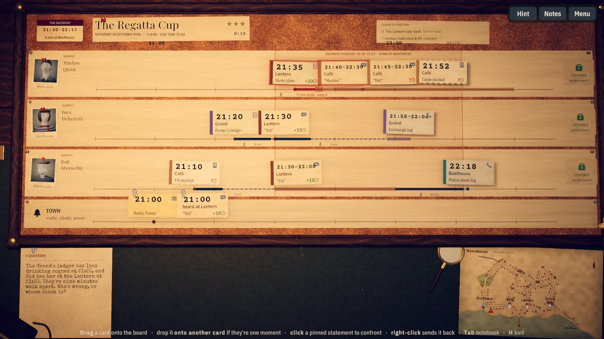
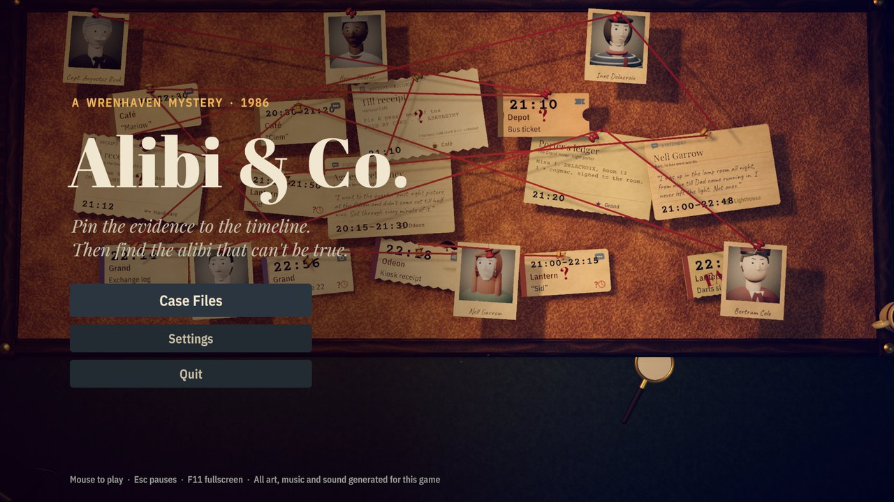
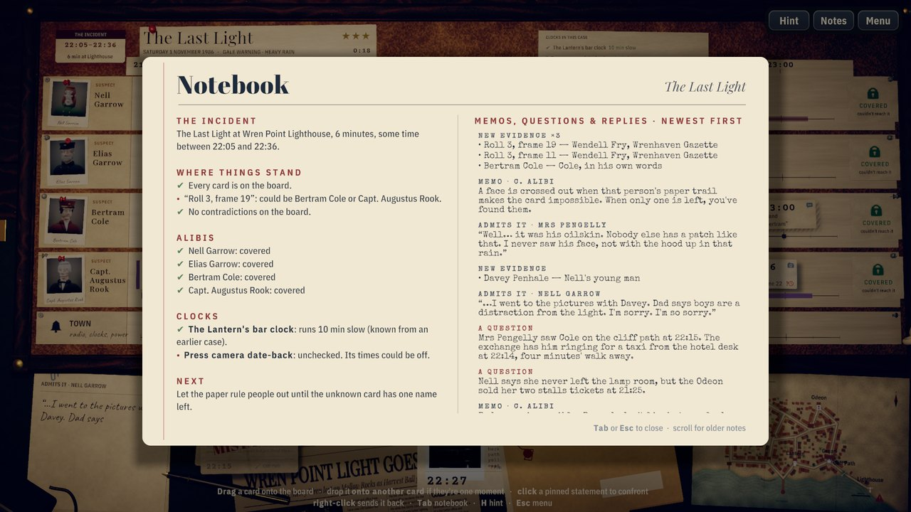
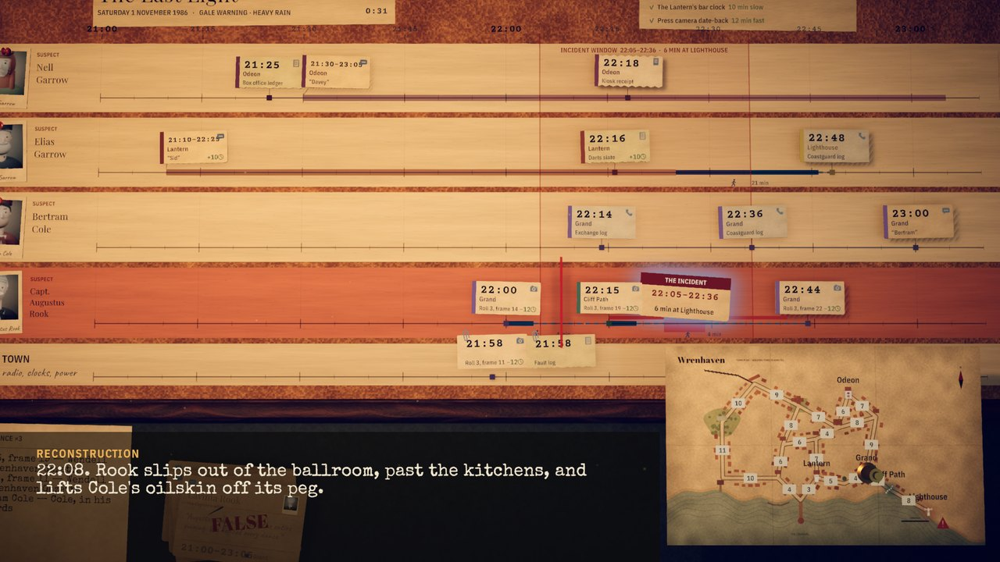
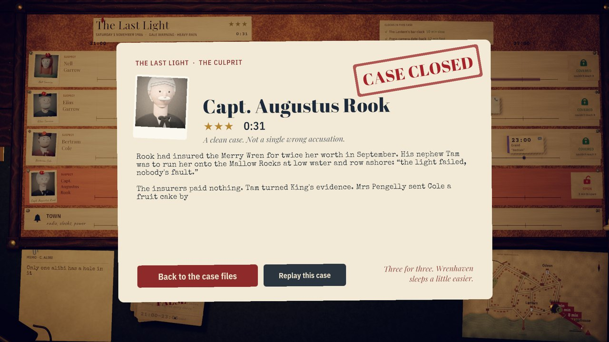

# Alibi & Co.

Pin receipts, phone logs, photographs and witness statements onto a shared timeline. Watch the
walking-time ribbons between them turn red when a story becomes physically impossible, then break
the one alibi that was too perfect.

Wrenhaven, a harbour town in autumn 1986. You're the "& Co." at retired DI Connie Alibi's
two-desk agency. She teaches through short typed memos clipped to the board, and the board does
the arithmetic. You do the doubting.



| | |
|---|---|
|  |  |
|  |  |

## Playing

```sh
Tools/play.sh          # runs Builds/Linux/AlibiAndCo.x86_64 (uses native Wayland when available)
```

The Linux standalone build is in `Builds/Linux/` (about 130 MB). Progress and settings are saved
automatically.

Settings: master, music and effects volume; resolution (the desktop size or any display mode
down to 1280 × 720); text size (Normal, Large, Larger), which scales the menus, HUD, notebook and
the enlarged card you see on hover; fullscreen; reduced motion; and the case timer.

### Controls

| Input | Action |
|---|---|
| Drag a card from the tray onto the board (or click it) | pin it to its person's line at its printed time |
| Hover a card | lift it, show the full text, and draw its walking routes on the town map |
| Hover the town map | zoom in on it |
| Drop a card onto another card | **link**: "these are the same moment on two clocks" |
| Click a pinned statement | open its panel: **Confront** or unpin |
| Right-click a pinned card | send it back to the tray |
| Drag the incident card | preview where the crime fits; drop it on a line to accuse |
| Tab (or the Notes button) | the notebook: where the case stands, what each clock is known to do, and every memo, question and witness reply so far |
| H or F1 | ask Connie for a hint (the case is marked "with Connie's help") |
| Space or click | skip a memo, or the reconstruction |
| Esc | pause (resume, settings, case files, quit) |
| F11 | toggle fullscreen |
| F12 | save a screenshot |

### Rules

- Every card claims that **someone was at a place at a time**. When you pin two cards on one
  person's line, a ribbon shows how long the walk between them takes on the town map. Blue means
  they had time, and the dotted tail is spare time. Red and hatched means it's impossible.
- **Paper beats people.** Records (receipts, logs, tickets, photos) are never false, but their
  clocks can be wrong. Statements can be false, and a lie isn't proof of guilt.
- **Link** two cards that describe the same moment. If one of the clocks is trusted, the other
  clock's error is found, and every card stamped by it slides to its true time.
- **Confront** a statement that's in a contradiction. If it's false, the witness admits it and
  the card is stamped FALSE. If it's true, they stand firm and you lose a badge. A wrong link also
  costs a badge.
- **Unknown-person cards** (a cash receipt, a figure in a photo) show candidate faces. Each face
  is crossed out when that person's paper trail rules them out. When only one is left, the card
  flies to their line.
- Each suspect's lane shows a lock: **COVERED** if they couldn't have reached the scene for long
  enough inside the incident window, **OPEN** if they could. The incident can be pinned only
  when the tray is empty, there are no contradictions, and it fits exactly one person's line. A
  wrong accusation is impossible by construction.
- Each case is rated with three badges (minus one per wrong confront or link) and a timer.

### Content

Three handcrafted cases on one shared town map, each introducing one idea:

| Case | Lanes | Teaches |
|---|---|---|
| 1. Sugar and Spite | 3 suspects | pinning, ribbons, contradictions, confronting, the incident pin |
| 2. The Regatta Cup | 3 suspects + Town | clocks and links: a calibration can clear one person and sink another |
| 3. The Last Light | 4 suspects + Town | unknown-person cards, camera date-back clocks, mistaken identity |

## Verification

- **Case validator.** `Assets/Scripts/Logic/CaseValidator.cs` searches every reachable board state
  (cards unlocked, clocks corrected, statements struck) and proves that each case has exactly one
  consistent solution, that every contradiction can be discovered, and that a wrong accusation is
  never possible. All three cases currently pass with 0 errors and 0 warnings. It runs:
  - inside Unity: `Tools/unity.sh validate` or `Tools/unity.sh test` (EditMode tests in
    `Assets/Tests/EditMode`);
  - outside Unity: `Tools/validate.sh [--verbose]`. This compiles the same `Logic/` files the game
    uses into a console app (`Tools/CaseValidator`) and exits non-zero if any case isn't airtight.
    It uses a system `dotnet` if there is one, and otherwise the .NET 8 SDK bundled inside the
    Unity Editor, so it needs nothing extra installed. `--verbose` walks through each solution.
- **Autoplay self-test.** `Tools/autoplay.sh [outdir]` launches the built game, plays all three
  cases through the real session code using the solver's moves, saves a screenshot per step and
  prints PASS/FAIL. Current result: 3/3 cases passed with 0 errors.
- **Real-input test.** `Tools/play.sh -alibiInputTest [outdir]` drives case 1 with simulated mouse
  events through the Input System (drag, hover, right-click, click, the Confront button, the
  incident drag) and logs `[AutoPilot] PASS input test` when every gesture lands.
- **Gameplay recording.** `Tools/record.sh [out.mp4] [cases]` has the built game play the cases
  with simulated mouse input at a watchable pace, captures every frame at a locked 30 fps through
  ffmpeg, rebuilds the soundtrack offline from a per-frame voice log (`Tools/mix_recording.py`),
  and muxes the two. The output goes to `Recordings/` (git-ignored). It needs `ffmpeg` on the
  PATH. Automated runs (autoplay, input test, recording) use a blank in-memory save, so they never
  touch your progress. The last full recording was 7 min 39 s, covered all three cases, had every
  gesture land (0 fallbacks) and lost no badges.

## Building

Unity **6000.6.2f1** with URP, Blender **4.5**, Python 3 with numpy.

```sh
Tools/unity.sh build-linux       # batch build to Builds/Linux/AlibiAndCo.x86_64
Tools/build.sh                   # same, but reuses a resident Editor if one is serving the project
Tools/unity.sh                   # open the project in the Editor
Tools/editor.sh serve|play|shot  # resident headless Editor for quick play-mode screenshots
```

`Tools/unity.sh` points the loader at a bundled `libxml2.so.2`, because the Editor links against
it and CachyOS ships only `libxml2.so.16`.

### Rebuilding assets

Every model, portrait, photo and the town map is generated by scripts in `ArtSource/` and
exported into `Assets/Resources/`:

```sh
blender -b -P ArtSource/build_assets.py -- props [--only lamp,mug] [--preview]
blender -b -P ArtSource/build_assets.py -- cards [--preview]     # card silhouettes per evidence kind
blender -b -P ArtSource/build_assets.py -- portraits [--preview]
blender -b -P ArtSource/build_assets.py -- map
blender -b -P ArtSource/build_assets.py -- photos
blender -b -P ArtSource/build_assets.py -- all
```

`--preview` renders a check image into `ArtSource/renders/`. The Blender renders are then
finished with Python and Pillow (run with `.venv/bin/python`): `Tools/photo_finish.py portraits`
and `Tools/photo_finish.py photos` give the portraits and press photos a 1980s print look, and
`Tools/map_finish.py` adds the paper finish to the town map. `Tools/make_textures.py` generates
every texture and icon procedurally, `Tools/make_icon.py` draws the app icon, and `Tools/synth_audio.py` synthesizes all the music,
ambience and sound effects with numpy (no samples).

## Project layout

```
Assets/Scripts/Logic/   pure C# board logic, shared by the game and the validator
Assets/Scripts/Game/    Unity side: stage, board, cards, drag, map, memos, reconstruction
Assets/Scripts/UI/      runtime-built uGUI screens (title, case files, intro, notebook, pause, settings, closed)
Assets/Scripts/Audio/   music crossfades, ducking, SFX bank
Assets/Resources/       Data (case and town JSON), Models, Portraits, Photos, Audio, Textures, Fonts
Assets/Editor/          build script and project setup
Assets/Tests/EditMode/  validator tests
ArtSource/              Blender generator scripts and .blend sources
Tools/                  build, play, autoplay, record, validate and asset scripts
docs/PLAN.md            the design and technical plan
docs/images/            README screenshots (from the autoplay run)
```

## Known gaps

- Text size doesn't enlarge the small chips pinned on the board or the memo slips on the desk;
  their text is read by hovering a chip (which brings up the scaled full card) or in the
  notebook. Large panels (case files, case intro, case closed, settings, notebook) are shrunk back
  to fit the screen at the larger sizes, so they stay about the same size.
- In a long-running headless Editor, the 3D scene sometimes renders magenta after several
  play-mode sessions. This hasn't happened in the standalone build.
